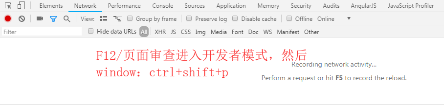

# 谷歌浏览器保存网页为长图片
---
chrome浏览器商店里也有许多截图增强扩展，但在截取一些比较复杂的网页时，往往会出现元素错位、重复的现象

要想使用截图功能，你需要首先确保 Chrome 已升级至 59 或更高版本。在想要截图的网页中，

1. 首先按下 ⌘Command + ⌥Option + I（Windows 为 F12）快捷键，召唤出调试界面。

2. 按下 ⌘Command + ⇧Shift + P（Windows 为 Ctrl + Shift + P），输入命令 Capture full size screenshot（只输前几个字母就能找到,

敲下回车，Chrome 就会自动截取整个网页内容并保存至本地。由于是渲染引擎直接输出，其比普通扩展速度更快，分辨率也更高。
3. 除了普通长截图以外，你还可以利用这一功能截取手机版网页长图。只需要按下 ⌘Command + ⇧Shift + M （Windows 为 Ctrl + Shift + M）模拟移动设备，再按刚才的方法运行命令就可以了。在顶部的工具栏中，你可以选择要模拟的设备和分辨率等设置。
4. 如果你想准确截取网页的某一部分，可以按下 ⌘Command + ⇧Shift + C（Windows 为 Ctrl + Shift + C）嗅探元素。选中想要的部分后，再运行 Capture node      screenshot 命令，一张完美的选区截图就诞生了。
